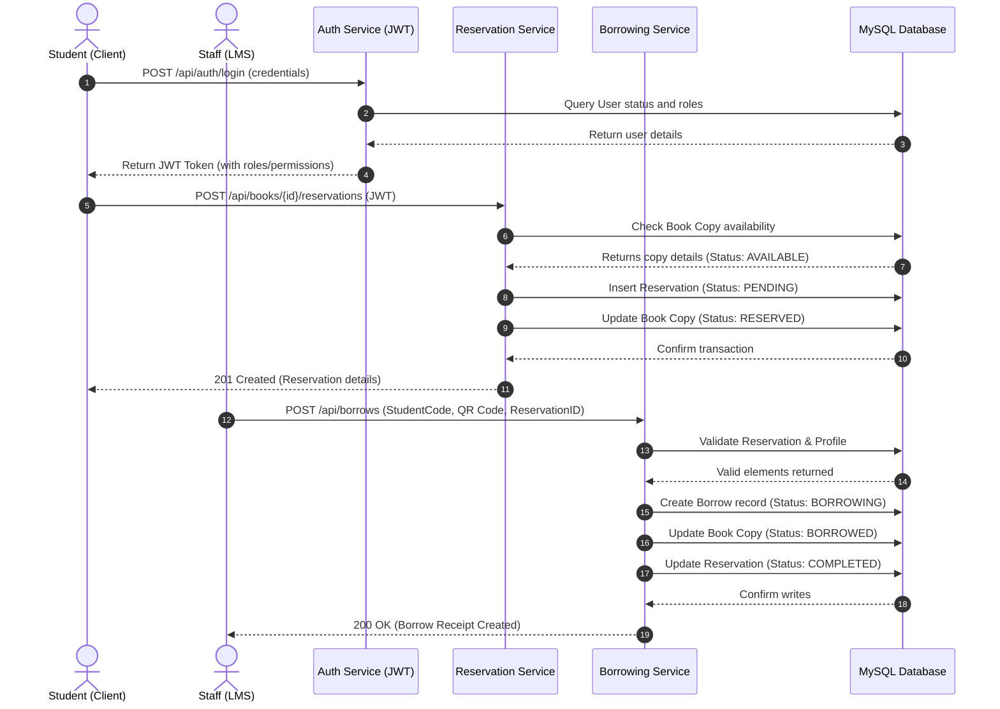

# Library Management System (LMS) Backend

[](https://openjdk.org/projects/jdk/21/)
[](https://spring.io/projects/spring-boot)
[](https://gradle.org)
[](https://www.mysql.com)
[](https://flywaydb.org)
[](https://spring.io/projects/spring-security)
[](https://opensource.org/licenses/MIT)

A production-ready, enterprise-grade backend for a **Library Management System (LMS)** designed with **Clean Architecture** principles, built using **Spring Boot 4.0.5** and **Java 21**. This system provides a robust solution for tracking books, handling borrowing/returning operations, calculating overdue fines, managing online book reservations, reporting book damages/losses, and enforcing strict Role-Based Access Control (RBAC) with Spring Security and JSON Web Tokens (JWT).

---

## Table of Contents
1. [Project Overview](#-project-overview)
2. [Project Architecture](#-project-architecture)
3. [Folder Structure](#-folder-structure)
4. [Database Design & ERD](#-database-design--erd)
5. [Sequence Diagrams](#-sequence-diagrams)
6. [Security & Authentication Design](#-security--authentication-design)
7. [API Documentation](#-api-documentation)
8. [Testing Strategy](#-testing-strategy)
9. [Installation & Setup](#-installation--setup)
10. [Environment Variables](#-environment-variables)
11. [Deployment Guide](#-deployment-guide)
12. [Git Flow Strategy](#-git-flow-strategy)
13. [Project Statistics](#-project-statistics)
14. [Future Improvements](#-future-improvements)

---

## Project Overview

This backend is engineered to address the complexities of modern library operations. It is optimized for performance, scalability, and security, making it a stellar demonstration of modern Java backend engineering capabilities.

### Core Modules
*   **Authentication & Authorization:** Secure JWT-based stateless login, token introspection, and Method-level Security using Spring Security.
*   **Role-Based Access Control (RBAC):** Dynamic role-permission mapping supporting `ADMIN`, `STAFF`, and `STUDENT` profiles.
*   **Catalog & Inventory:** Hierarchical category management, book details, physical location assignments (Room/Shelf/Row), and book copy indexing.
*   **Circulation Management:** Complete workflow for reserving books, borrowing books, returning books, tracking late returns, and calculating fines.
*   **Incident Management:** Reporting lost/damaged books by staff or students, assigning support agents, and tracking comments for resolution.
*   **Fine & Payment:** Automated calculation of fines for overdue returns. Multi-method payment tracking linked directly to outstanding violation reports.
*   **Personal Space (`/api/me`):** A secure endpoint for logged-in users to query their profile, borrowing history, active reservations, and fine balances.
*   **Reports & Statistics:** Daily and monthly automated summaries detailing library throughput (borrowing counts, return rates, loss percentages, and revenue).

---

## Project Architecture

The application is architected around **Domain-Driven Design (DDD)** and **Clean Architecture** patterns to ensure high modularity, maintainability, and clean separation of concerns.

### Architectural Diagram
```
                     ┌─────────────────────────────────────────┐
                     │          Client / Swagger UI            │
                     └────────────────────┬────────────────────┘
                                          │ HTTP Requests (REST)
                                          ▼
                     ┌─────────────────────────────────────────┐
                     │             Controller Layer            │
                     │  - Intercepts HTTP requests             │
                     │  - Validates DTOs (@Valid)              │
                     └────────────────────┬────────────────────┘
                                          │ DTOs (Request / Response)
                                          ▼
                     ┌─────────────────────────────────────────┐
                     │              Service Layer              │
                     │  - Holds core business logic            │
                     │  - Manages transactions (@Transactional) │
                     │  - Checks authorization (@PreAuthorize) │
                     └──────────┬───────────────────┬──────────┘
                                │                   │
             Uses MapStruct     │                   │ Reads/Writes
             for Mapping        ▼                   ▼ via Spring Data JPA
                     ┌──────────┴─────────┐ ┌───────┴──────────┐
                     │    Mapper Layer    │ │ Repository Layer │
                     │ - Entity <-> DTO   │ │ - DB Queries     │
                     └────────────────────┘ └───────┬──────────┘
                                                    │
                                                    ▼
                                            ┌──────────────┐
                                            │ MySQL Database│
                                            └──────────────┘
```

### Key Principles Applied:
*   **Dependency Injection:** Inversion of Control achieved using Constructor Injection (simplified via Lombok's `@RequiredArgsConstructor` / `@AllArgsConstructor`).
*   **DTO Pattern:** Keeps database model schema confidential and separates presentation models from database persistence mapping.
*   **Global Exception Handling:** Centralized exception handling using `@RestControllerAdvice`, mapping internal domain errors to standardized HTTP status codes and unified JSON formats (`ApiResponse`).
*   **Database Migrations:** Flyway manages all database versions natively, ensuring structured schema evolutions.

---

## Folder Structure

```text
librarymanagement/
├── .github/
│   ├── ISSUE_TEMPLATE/
│   │   ├── bug_report.md
│   │   └── feature_request.md
│   └── pull_request_template.md
├── gradle/
│   └── wrapper/
├── src/
│   ├── main/
│   │   ├── java/com/quangtruong/librarymanagement/
│   │   │   ├── config/              # Security and Spring Bean configurations
│   │   │   ├── controller/          # REST API endpoints
│   │   │   ├── dto/                 # Request/Response payloads
│   │   │   ├── entity/              # JPA Database models
│   │   │   ├── exception/           # Exception definitions and Global Handler
│   │   │   ├── mapper/              # MapStruct converters
│   │   │   ├── repository/          # Database access interfaces
│   │   │   ├── service/             # Business logic service implementations
│   │   │   └── util/                # Utility classes (Date, Token helper, etc.)
│   │   └── resources/
│   │       ├── db/migration/        # Flyway SQL schema and seed files
│   │       ├── templates/           # Email or render templates
│   │       └── application.properties # Main application properties
│   └── test/
│       └── java/com/quangtruong/librarymanagement/ # Unit & Integration tests
├── build.gradle                     # Build dependencies & version configuration
├── CHANGELOG.md                     # History of features, fixes, & updates
├── CONTRIBUTING.md                  # Team development contribution guide
├── RELEASE_NOTES.md                 # Details on versions & current releases
└── settings.gradle                  # Gradle project root setup
```

---

## Database Design & ERD

The database schema is optimized for relational integrity, data normalization, and fast retrieval. 

### Entity-Relationship Diagram (ERD)
The schema contains relationships spanning from Core Users to Circulation, Incidents, and Billing. Below is the relational structure represented in a Mermaid diagram:

```mermaid
erDiagram
    user {
        BINARY16 id PK
        VARCHAR name
        VARCHAR password
        VARCHAR email UK
        BIGINT status_id FK
    }
    user_status {
        BIGINT id PK
        VARCHAR name UK
    }
    role {
        BIGINT id PK
        VARCHAR name UK
        VARCHAR description
    }
    permission {
        BIGINT id PK
        VARCHAR name UK
        VARCHAR description
    }
    user_role {
        BINARY16 user_id FK
        BIGINT role_id FK
    }
    role_permission {
        BIGINT role_id FK
        BIGINT permission_id FK
    }
    student_profile {
        BINARY16 id PK "FK to user.id"
        VARCHAR student_code UK
        VARCHAR phone
        VARCHAR gender
        DATE dob
        VARCHAR address
        INT enrollment_year
        VARCHAR avatar_url
        BIGINT clazz_id FK
    }
    staff_profile {
        BINARY16 id PK "FK to user.id"
        VARCHAR employee_code UK
        VARCHAR phone
        VARCHAR gender
        DATE dob
        VARCHAR address
        VARCHAR avatar_url
        BIGINT position_id FK
    }
    staff_position {
        BIGINT id PK
        VARCHAR name UK
    }
    clazz {
        BIGINT id PK
        VARCHAR name UK
        VARCHAR course_year
        BIGINT faculty_id FK
    }
    faculty {
        BIGINT id PK
        VARCHAR name UK
    }
    book {
        BIGINT id PK
        VARCHAR name
        TEXT description
        DECIMAL price
        INT publisher_year
        BIGINT category_id FK
        BIGINT publisher_id FK
    }
    category {
        BIGINT id PK
        VARCHAR name
        VARCHAR description
    }
    publisher {
        BIGINT id PK
        VARCHAR name
        VARCHAR email
        VARCHAR contact
    }
    author {
        BIGINT id PK
        VARCHAR name
    }
    book_author {
        BIGINT book_id FK
        BIGINT author_id FK
    }
    book_copy {
        BIGINT id PK
        VARCHAR qr_code UK
        VARCHAR status
        BIGINT book_id FK
        BIGINT booklocation_id FK
    }
    book_location {
        BIGINT id PK
        VARCHAR name
        VARCHAR description
    }
    reservation {
        BIGINT id PK
        DATETIME reservation_date
        DATETIME expired_date
        VARCHAR status
        BINARY16 student_profile_id FK
        BIGINT book_copy_id FK
    }
    borrow {
        BIGINT id PK
        DATETIME borrow_date
        DATETIME due_date
        VARCHAR status
        BINARY16 student_profile_id FK
        BINARY16 staff_profile_id FK
    }
    borrow_detail {
        BIGINT id PK
        DATETIME return_date
        VARCHAR note
        BIGINT borrow_id FK
        BIGINT book_copy_id FK
    }
    fine {
        BIGINT id PK
        VARCHAR fine_type
        DECIMAL reference_price
        VARCHAR status
        BINARY16 student_profile_id FK
        BIGINT borrow_detail_id FK
    }
    payment {
        BIGINT id PK
        VARCHAR payment_method
        BINARY16 student_profile_id FK
        BINARY16 staff_profile_id FK
    }
    payment_detail {
        BIGINT id PK
        DECIMAL amount_allocated
        BIGINT payment_id FK
        BIGINT fine_id FK
    }
    incident {
        BIGINT id PK
        VARCHAR title
        TEXT description
        VARCHAR priority
        VARCHAR status
        BINARY16 reporter_id FK
        BINARY16 assignee_id FK
        VARCHAR resolution_note
        DATETIME created_date
        DATETIME updated_date
    }
    incident_comment {
        BIGINT id PK
        BIGINT incident_id FK
        BINARY16 user_id FK
        TEXT content
        DATETIME created_date
    }
    review {
        BIGINT id PK
        INT rating
        TEXT comment
        DATETIME created_at
        DATETIME updated_at
        BIGINT book_id FK
        BINARY16 student_profile_id FK
    }
    notification {
        BIGINT id PK
        VARCHAR title
        TEXT content
        VARCHAR status
        BINARY16 user_id FK
    }

    user ||--|| student_profile : "has"
    user ||--|| staff_profile : "has"
    user }o--|| user_status : "status"
    user_role }o--|| user : "belongs to"
    user_role }o--|| role : "has role"
    role_permission }o--|| role : "belongs to"
    role_permission }o--|| permission : "has permission"
    student_profile }o--|| clazz : "member of"
    clazz }o--|| faculty : "part of"
    staff_profile }o--|| staff_position : "holds"
    book }o--|| category : "categorized by"
    book }o--|| publisher : "published by"
    book_author }o--|| book : "has"
    book_author }o--|| author : "written by"
    book_copy }o--|| book : "copy of"
    book_copy }o--|| book_location : "located at"
    reservation }o--|| student_profile : "reserved by"
    reservation }o--|| book_copy : "references"
    borrow }o--|| student_profile : "borrowed by"
    borrow }o--|| staff_profile : "approved by"
    borrow_detail }o--|| borrow : "belongs to"
    borrow_detail }o--|| book_copy : "targets copy"
    fine }o--|| student_profile : "issued to"
    fine }o--|| borrow_detail : "based on"
    payment }o--|| student_profile : "paid by"
    payment }o--|| staff_profile : "received by"
    payment_detail }o--|| payment : "part of"
    payment_detail }o--|| fine : "settles"
    incident }o--|| user : "reported by"
    incident }o--|| user : "assigned to"
    incident_comment }o--|| incident : "belongs to"
    incident_comment }o--|| user : "authored by"
    review }o--|| book : "reviews"
    review }o--|| student_profile : "written by"
    notification }o--|| user : "sent to"
```



### Database Optimization & Performance Actions:
1.  **Unique Constraints:** Avoids duplicate business-sensitive entities (e.g., `user_email`, `qr_code`, `student_code`, `employee_code`, and unique combination of `book_id` + `student_profile_id` for book reviews).
2.  **Stateless Enums:** Status fields (such as `status` in book copies, borrowing records, and fines) are stored as indexing-friendly string values or state control relationships.
3.  **UUID PKs for Users:** Prevents ID enumeration attacks by generating security-proof UUIDs (`BINARY(16)`) for the primary key of core users and profiles.

---

## Sequence Diagrams

To demonstrate how the modules work together, here is the sequence flow for a standard **Book Reservation & Borrowing Lifecycle**:



---

## Security & Authentication Design

The application's security structure relies on a robust implementation of Spring Security and OAuth2 Resource Server.

### Key Architecture Components:
*   **JSON Web Tokens (JWT):** Secure asymmetric-like custom signers decode the credentials using `NimbusJwtDecoder` with a 256-bit symmetric key (`HS256`).
*   **Stateless Sessions:** Disables default HTTP sessions and CSRF protection to construct a completely stateless API environment.
*   **Dynamic Authority Mapping:** Custom `JwtGrantedAuthoritiesConverter` maps JWT claim authorities directly into the security context without prefixes, allowing native integration with `@PreAuthorize("hasAuthority('BOOK_CREATE')")` or role assertions `@PreAuthorize("hasRole('STUDENT')")`.
*   **Secure Password Storage:** Automatically encodes passwords with BCrypt before writing them to the database.

```text
Client Request  --->  [Authorization: Bearer <token>]
                              │
                              ▼
                       SecurityFilterChain
                              │
                    BearerTokenAuthenticationFilter
                              │
                              ▼
                       JwtDecoder (Nimbus)
                              │  (Decodes and validates signatures)
                              ▼
                 JwtGrantedAuthoritiesConverter
                              │  (Extracts claims into GrantedAuthority)
                              ▼
                     SecurityContextHolder
                              │  (Populates authentication instance)
                              ▼
                  Method-level Authorization
             (@PreAuthorize checks permissions)
                              │
                              ▼
                    Target REST Controller
```

---

## API Documentation

The REST APIs are fully documented and follow HTTP protocol standards, including appropriate REST verbs and status codes.

### Key Endpoint Groups

#### 1. Authentication (`/api/auth`)
*   `POST /api/auth/login`: Issue access token.
    *   *Payload:* `{"email": "...", "password": "..."}`
    *   *Response:* `200 OK` with JSON object containing JWT access token and expiry details.
*   `POST /api/auth/introspect`: Validate token status.

#### 2. Book Catalog & Inventory (`/api/books`)
*   `GET /api/books`: Paginated book search. Supports filters `keyword`, `categoryId`, `authorId`.
*   `POST /api/books`: Register book.
*   `PUT /api/books/{id}`: Modify metadata.
*   `DELETE /api/books/{id}`: Delete book.
*   `PUT /api/books/{id}/shelf`: Update physical location mapping.
*   `PATCH /api/books/{id}/stock`: Modify quantities.

#### 3. Personal Actions (`/api/me`)
*   `GET /api/me/profile`: Retrieve profile details.
*   `GET /api/me/borrowed-items`: View list of books currently borrowed.
*   `GET /api/me/borrow-history`: Historical ledger of borrowing history.
*   `GET /api/me/reservations`: View active book reservations.
*   `GET /api/me/violations`: Check for penalties and fine records.
*   `GET /api/me/fines`: Get total outstanding fine amount.

---

## Testing Strategy

Quality assurance is integrated into the build pipeline using JUnit 5, Mockito, and Spring Boot testing tools.

### Types of Tests Implemented:
*   **Unit Tests:** Isolate business logic by mocking database interaction using Mockito (`@Mock`, `@InjectMocks`).
*   **Web MVC Controller Tests:** Test controller routing, payload validation, and HTTP serialization using Mockito and `@WebMvcTest`.
*   **Integration Tests:** Verify database transactions, repository queries, and schema compliance on an actual H2/MySQL database using `@SpringBootTest`.

### Sample Unit Test Code Structure:
```java
@ExtendWith(MockitoExtension.class)
class BookServiceTest {

    @Mock
    private IBookRepository bookRepository;

    @InjectMocks
    private BookServiceImpl bookService;

    @Test
    void whenGetBookDetails_withValidId_shouldReturnBookDto() {
        // Arrange
        Long bookId = 1L;
        Book mockBook = Book.builder().id(bookId).name("Clean Architecture").build();
        Mockito.when(bookRepository.findById(bookId)).thenReturn(Optional.of(mockBook));

        // Act
        BookResponse response = bookService.getBookDetails(bookId);

        // Assert
        Assertions.assertNotNull(response);
        Assertions.assertEquals("Clean Architecture", response.getName());
    }
}
```

---

## ⚙️ Installation & Setup

Follow these instructions to clone, build, and run the project locally.

### Prerequisites:
*   **Java SE Development Kit (JDK) 21** or later
*   **MySQL Server (8.0+)**
*   **Gradle 8+** (packaged wrapper included)

### Step-by-Step Setup:

1.  **Clone the Repository:**
    ```bash
    git clone https://github.com/yourusername/librarymanagement.git
    cd librarymanagement
    ```

2.  **Configure Database:**
    Open MySQL client and run:
    ```sql
    CREATE DATABASE library_management CHARACTER SET utf8mb4 COLLATE utf8mb4_unicode_ci;
    ```

3.  **Update Configuration:**
    Edit the configurations in `src/main/resources/application.properties` (or set the environment variables listed below) to match your credentials.

4.  **Build Project:**
    Compile project code and run tests using:
    ```bash
    ./gradlew clean build
    ```

5.  **Run Application:**
    Start the embedded Tomcat server:
    ```bash
    ./gradlew bootRun
    ```
    *The application will boot at `http://localhost:8080`.*

---

## Environment Variables

The application can be configured dynamically at runtime using the following environment variables:

| Variable Name | Description | Default Value |
| --- | --- | --- |
| `SPRING_DATASOURCE_URL` | Database connection URL | `jdbc:mysql://localhost:3306/library_management` |
| `SPRING_DATASOURCE_USERNAME` | Database login username | `root` |
| `SPRING_DATASOURCE_PASSWORD` | Database login password | `123456` |
| `JWT_SIGNER_KEY` | Symmetric signature key (256-bit hex) | `0418f54ba86755f0a1ce5...` |
| `SERVER_PORT` | HTTP port server will listen on | `8080` |
| `SPRING_FLYWAY_ENABLED` | Toggle schema auto-migration | `true` |

---

## Deployment Guide

### 1. Dockerization
Create a `Dockerfile` in the root directory:
```dockerfile
# Build stage
FROM gradle:8-jdk21 AS build
COPY --chown=gradle:gradle . /home/gradle/src
WORKDIR /home/gradle/src
RUN ./gradlew build --no-daemon -x test

# Runtime stage
FROM openjdk:21-slim
EXPOSE 8080
COPY --from=build /home/gradle/src/build/libs/*.jar lms-backend.jar
ENTRYPOINT ["java", "-jar", "/lms-backend.jar"]
```

Build and run using Docker:
```bash
docker build -t lms-backend .
docker run -p 8080:8080 --name lms-app --env-file .env lms-backend
```

### 2. CI/CD Deployment Flow
```
Developer Push ──> GitHub Actions ──> Run Tests ──> Build Docker Image ──> Push to Registry ──> Deploy to VPS/Cloud
```

---

## Git Flow Strategy

We implement the standard Git Flow workflow to coordinate team developments:

*   `main`: Contains production-ready releases.
*   `develop`: The primary branch for staging development features.
*   `feature/*`: Branching off `develop` to build isolated features (e.g., `feature/payment-integration`).
*   `bugfix/*`: Short-lived branches off `develop` to resolve issues before merge tags.
*   `hotfix/*`: Branching off `main` to address critical production issues immediately.

---

## Project Statistics
*   **Language Distribution:** 100% Java
*   **Frameworks:** Spring Boot 4.0.5, Spring Security, JPA Hibernate
*   **Architecture Pattern:** Clean Architecture / DDD
*   **Database Migrations:** 13 versioned Flyway steps

---

## Future Improvements
1.  **Caching layer:** Integrate Redis to cache hot book records and category details to reduce database load.
2.  **Elasticsearch integration:** Enhance book searching by replacing simple database query queries with a full-text search engine.
3.  **Message Queue:** Implement RabbitMQ/Kafka for asynchronous operations like sending notification emails when books are overdue.
4.  **Batch Processing:** Add Spring Batch to process daily checks on overdue borrows and automatically generate fine entries.
